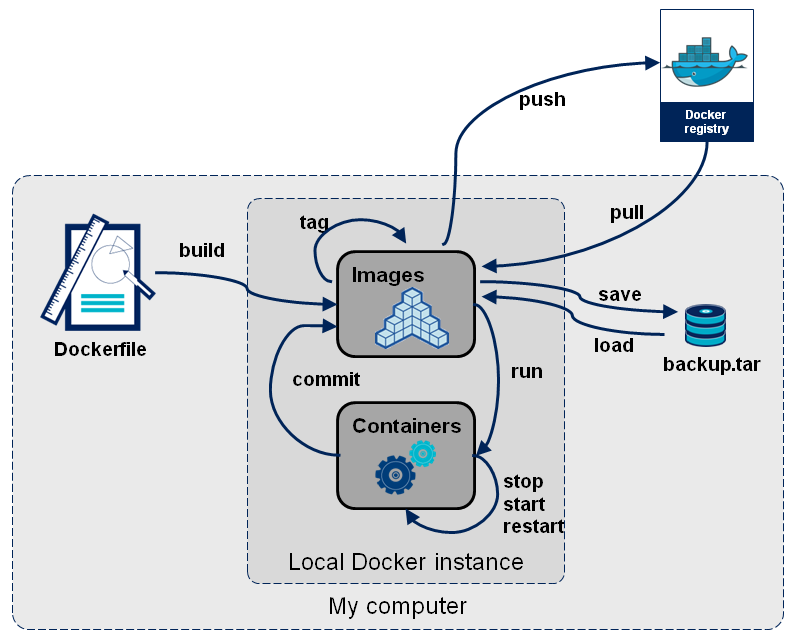

# Docker 概述

## 一、Docker 简介

Docker是一个开源的应用容器引擎，基于Go语言并遵从Apache2.0协议开源。Docker可以让开发者打包他们的应用以及依赖包到一个轻量级、可移植的容器中，然后发布到任何流行的Linux机器上，也可以实现虚拟化。

**Docker三要素**：

- **仓库**：仓库可看着一个代码控制中心，用来保存镜像。
- **镜像**：镜像是一种轻量级、可执行的独立软件包，用来打包软件运行环境和基于运行环境开发的软件，它包含运行某个软件所需的所有内容，包括代码、运行时、库、环境变量和配置文件。Docker镜像，就相当于是一个root文件系统。
- **容器**：镜像（Image）和容器（Container）的关系，就像是面向对象程序设计中的类和实例一样，镜像是静态的定义，容器是镜像运行时的实体。容器可以被创建、启动、停止、删除、暂停等。

## 二、Docker 安装

* 官方安装文档：[https://docs.docker.com/install/linux/docker-ce/centos/](https://docs.docker.com/install/linux/docker-ce/centos/)

### 配置镜像加速器

* Docker镜像加速
  - 阿里云的加速器：[https://help.aliyun.com/document_detail/60750.html](https://help.aliyun.com/document_detail/60750.html) 
  - 网易加速器：[http://hub-mirror.c.163.com](http://hub-mirror.c.163.com)
  - 官方中国加速器：[https://registry.docker-cn.com](https://registry.docker-cn.com)
  - 中国科学技术大学镜像：[https://docker.mirrors.ustc.edu.cn](https://docker.mirrors.ustc.edu.cn)

* 使用upstart的系统，通过编辑/etc/default/docker文件，在其中的DOCKER_OPTS中配置加速器地：
  ```shell
  DOCKER_OPTS="--registry-mirror=https://xxxxx.mirror.aliyuncs.com"
  ```

* 使用systemd的系统，通过修改daemon配置文件/etc/docker/daemon.json来使用加速器：

  ```shell
  sudo mkdir -p /etc/docker
  sudo tee /etc/docker/daemon.json <<-'EOF'
  {
    "registry-mirrors": ["https://xxxxx.mirror.aliyuncs.com"]
  }
  EOF
  sudo systemctl daemon-reload
  sudo systemctl restart docker
  ```

## 三、Docker 命令

通过帮助命令查看所有命令。

- 查看全部命令：`docker help`
- 查看指定命令的帮助：`docker [COMMAND] --help`

Docker子命令分类如下：

| 类别 | 子命令 |
| --- | --- |
| Docker环境信息 | info、version |
| 容器生命周期管理 | create、exec、kill、pause、restart、rm、run、start、stop、unpause |
| 镜像仓库命令 | login、logout、pull、push、search |
| 镜像管理 | build、images、import、load、rmi、save、tag、commit |
| 容器运维管理 | attach、export、inspect、port、ps、rename、stats、top、wait、cp、diff、update |
| 容器资源管理 | volume、network |
| 系统日志信息 | events、history、logs |

Docker命令的结构图如下：



### 其他

- 进入容器后，不退出容器的退出命令：ctrl+p+q